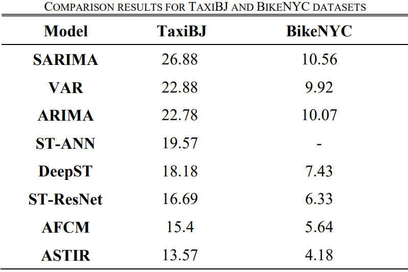

# ASTIR: Spatio-Temporal Data Mining for Crowd Flow Prediction

## Paper

This is the repository for the papaer published in [IEEE Access journal](https://ieeexplore.ieee.org/document/8889654).

## Architecture


## Results



## Citation

```bibtex
@ARTICLE{Mourad_Shen_2021_Spatio,
  author={Mourad, Lablack and Qi, Heng and Shen, Yanming and Yin, Baocai},
  journal={IEEE Access},
  title={ASTIR: Spatio-Temporal Data Mining for Crowd Flow Prediction},
  year={2019},
  volume={7},
  number={},
  pages={175159-175165},
  doi={10.1109/ACCESS.2019.2950956}}

```
